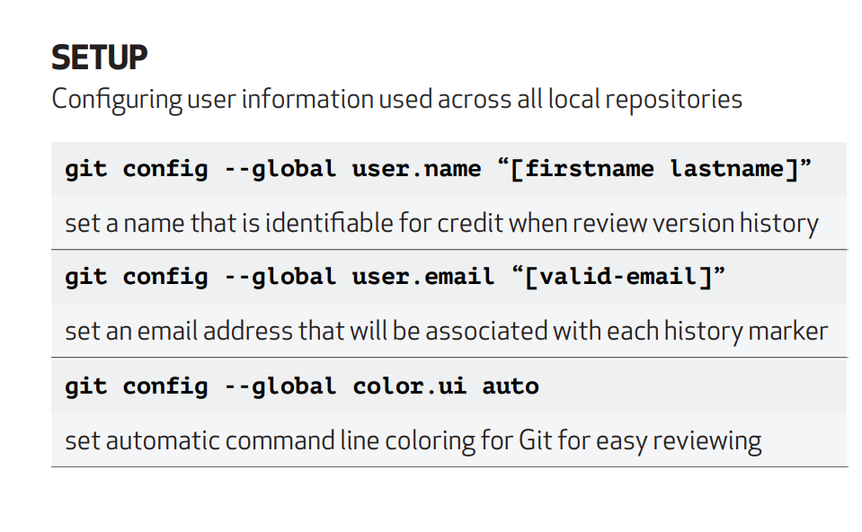

# Git Cheatsheet

## Step: Create a Repository

To make a new folder:

```
$ mkdir hello-world
```

To go into that folder:

```
$ cd hello-world
```

To create a new Git instance for a project:

```
$ git init

git status
```

Step: Status, Add and Commit Changes

```
$ git add readme.txt
$ git commit -m "<your commit message>"
```

Step: Make More Changes

```
$ git diff
```

To add all files changes

```
$ git add .
```

Step: Add username to Git

```
$ git config --global user.username <USerNamE>
```

Step: Connect your Local to your Remote

```
$ git remote add origin <URLFROMGITHUB>
//or ssh link from github
```

Step: Push Work to your Remote

```
$ git push origin master
```

Set a URL to a remote

```
$ git remote set-url <REMOTENAME> <URL>
```

Pull in changes

```
$ git pull <REMOTENAME> <BRANCHNAME>
```

View remote connections

```
$ git remote -v
```

Forking (making a copy on your github account and than cloning the repo to local)

**note: dont make a new folder because cloning will automatically make one**

**note: don't clone in existing repo**

```
$ git clone <URLFROMGITHUB>
```

---

## Branching

```
$ git branch <BRANCHNAME>
```

Move onto a branch:

```
$ git checkout <BRANCHNAME>
```

You can create and switch to a branch in one line:

```
$ git checkout -b <BRANCHNAME>
```

List the branches:

```
$ git branch
```

Rename a branch you're currently on:

```
$ git branch -m <NEWBRANCHNAME>
```

Pull in changes from a remote branch

```
$ git pull <REMOTENAME> <REMOTEBRANCH>
```

See changes to the remote before you pull in

```
$ git fetch --dry-run
```

---

## Merge

First, move into the branch you want to merge into — in this case, branch 'gh-pages'.

```
$ git checkout gh-pages
```

Merge a branch into current branch (tell Git what branch you want to merge in )

```
$ git merge <BRANCHNAME>
```

Tidy up by deleting your feature branch now that it has been merged.

```
$ git branch -d <BRANCHNAME>
```

You can also delete the branch from your fork on GitHub:

```
$ git push <REMOTENAME> --delete <BRANCHNAME>
```

Pull from a remote branch

```
$ git pull <REMOTENAME> <BRANCHNAME>
$ git pull upstream gh-pages
//(upstream is like origin but it is the original remote repo you forked from)
```

## git config

link: [link to this cheat sheet](https://education.github.com/git-cheat-sheet-education.pdf)

image : 
