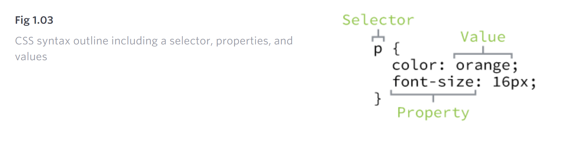

## CSS Terms

---

### Selectors:

A selector designates exactly which element or elements within our HTML to target and apply styles (such as color, size, and position) to.

Selectors generally target an attribute value, such as an **id** or **class value**, or target the type of **element**, such as \<h1\> or \<p\>.

```
p { ... }

// The selector here is targeting all <p> elements.
```

### Properties:

Once an element is selected, a property determines the styles that will be applied to that element.

There are numerous properties we can use, such as background, color, font-size, height, and width.

```
p {
  color: ...;
  font-size: ...;
}

// color and font-size are the properties
```

### Values:

Determine the behavior of that property with a value.

```
p {
  color: orange;
  font-size: 16px;
}

// orange is the value of color property
```


