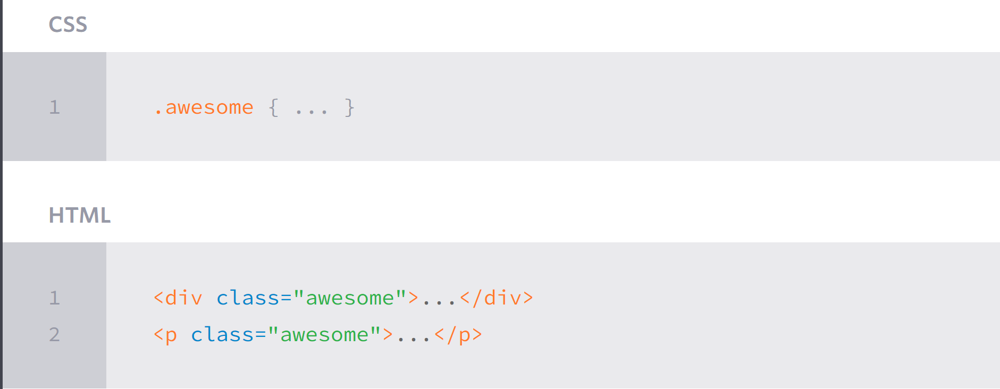

## Working with Selectors

### Type Selectors:

Type selectors target elements by their element type.

For example, should we wish to target all division elements, \<div\>, we would use a type selector of div.

### Class Selectors:

Class selectors allow us to select an element based on the element’s class attribute value.

Class selectors allow us to apply the same styles to different elements at once by using the same class attribute value across multiple elements.

Within CSS, classes are denoted by a leading period, ., followed by the class attribute value.

Here the class selector will select any element containing the class attribute value of awesome, including both division and paragraph elements.

### ID Selectors

ID selectors are even more precise than class selectors, as they target only one unique element at a time.

ID selectors use an element’s id attribute value as a selector.

Regardless of which type of element they appear on, id attribute values can only be used once per page.

Within CSS, ID selectors are denoted by a leading hash sign, #, followed by the id attribute value. Here the ID selector will only select the element containing the id attribute value of shayhowe.

