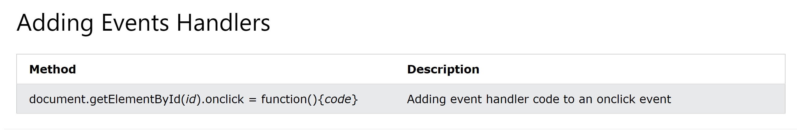

DOM = Document Object Model

Why html to DOM?

This is to allow JavaScript code to manipulate what the user sees on the screen by providing a way to interact with this data.

JS CAN:

- Add / remove / change any HTML element (tag) or property of an element (attribute).

  e.g click on button and a pop up box opens. JS has a function that listens to the click and add the contents of pop up to the DOM. than DOM tells browser to show it on screen.

- Change the CSS styles of the page.

- Add / react to DOM events on the page.

# DOM Events

"DOM events" are like click or press key. They are tied to elements on DOM and send broadcast to the page like something is clicked. JS function listens to the broadcast then run a function when it receives that broadcast.

## "The Listener" & "The Handler"

A click event is a trigger. The function that is then run to react to that trigger is "The Listener" or "The Handler".

Below link to access

Changing html code with JS: (Click on it)

<https://www.w3schools.com/js/js_htmldom_document.asp>
