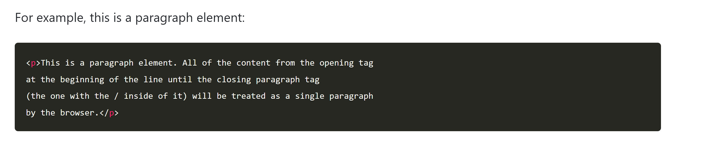
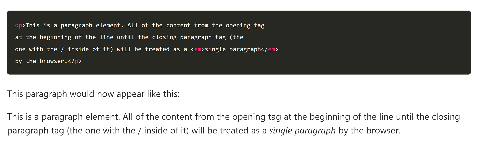
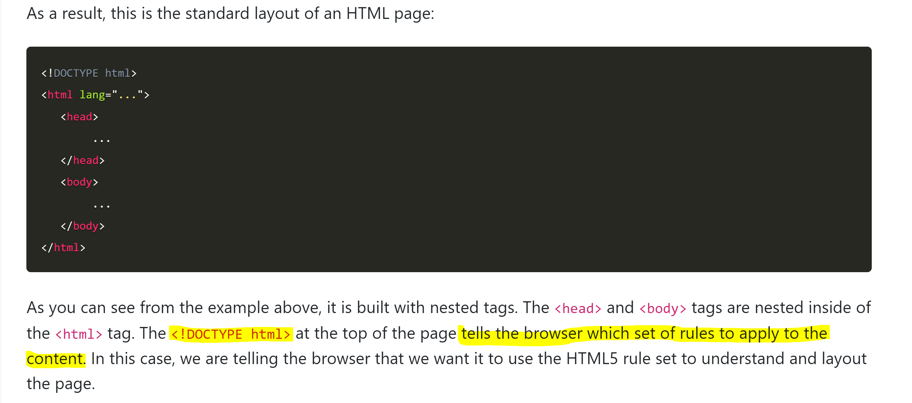
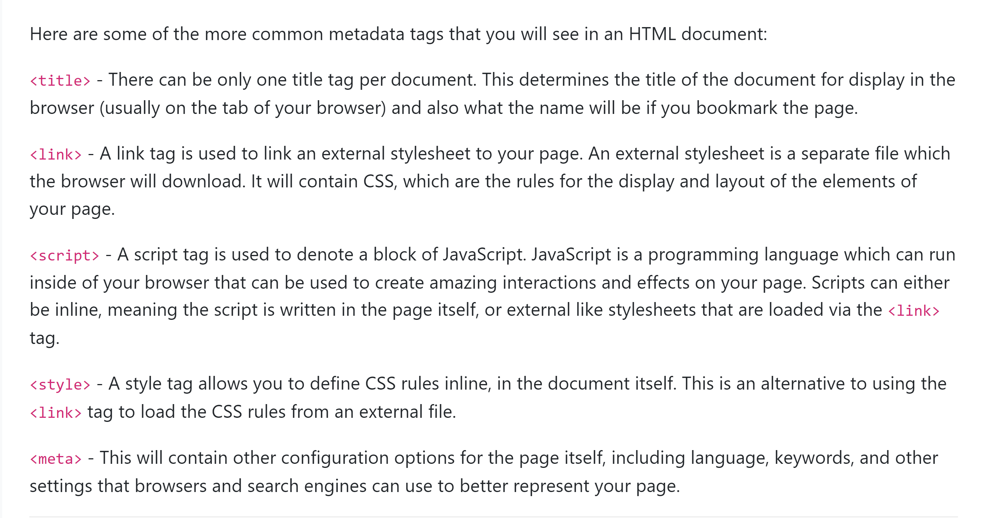
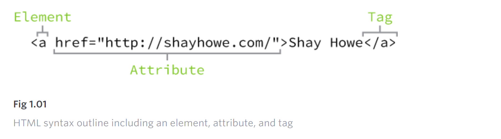

## Tags & Elements

---

A tag is a letter or word surrounded by angle brackets (< and >).

The tag determines what the browser is going to do with the content inside of it. Most tags wrap around content.

```
Example of anchor tags:
<a>...</a>
```

**Element:** Tag starts an _element_ that is the content inside of tag. How the content will behave is decided by the tags surrounding it.

```
Example of elements:

<a>  , <h1> , <p1>, <a>, <div>, <span>, <strong>, and <em> etc
```

**Closing tag:** The closing tags are indicated by putting a / character before the tag name. An opening header tag looks like this: \<header\>, and a closing header tag looks like this: \<\/header>. Together they form the header element.



### Nested tags

---

Sometimes, you can have tags inside of other tags. Let's say that you have a paragraph like the one above. But, this time, we want to emphasize the words 'single paragraph' just before the end. HTML gives us the ability to do that, using the \<em\> tag.



The \<em\> element is considered nested within the \<p\> element, as it is one element inside of another.

## Page Structure

---

There are two main components of the page which the browser analyzes to understand how to present the page correctly.

1. content
2. tags

Tags wrap around content to establish the layout of the page.

The browser also needs other information about how to draw the page.

- \<head\>
- \<body\>



### Body and Head tags

---


## Common Metadata Tags

---



# Attributes

Attributes are properties used to provide additional information about an element.

The most common attributes include the id attribute, which identifies an element;

1. the class attribute, which classifies an element;

2. the src attribute, which specifies a source for embeddable content; and

3. the href attribute, which provides a hyperlink reference to a linked resource.

Attributes are defined within the opening tag, after an element’s name.

```
<a href="http://shayhowe.com/">Shay Howe</a>
```

Above code will display the text “Shay Howe” on the web page and will take users to http://shayhowe.com/ upon clicking the “Shay Howe” text.


