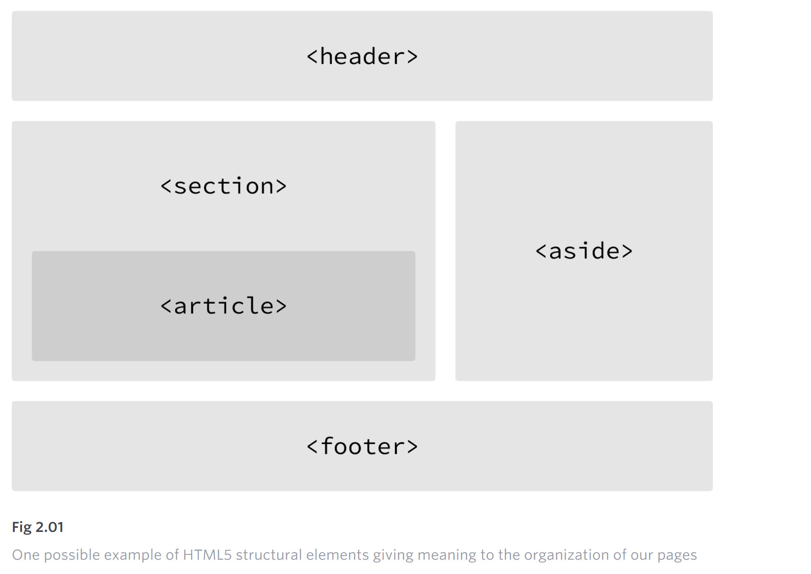
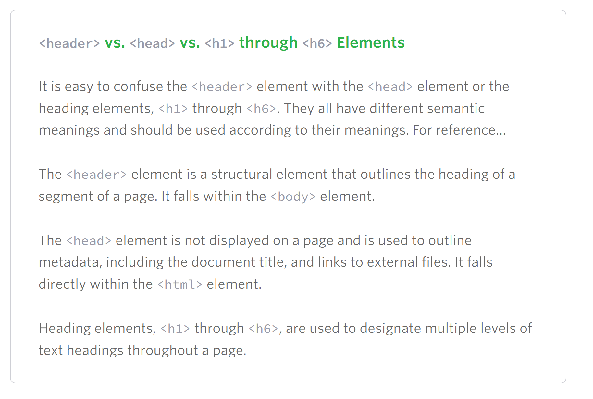
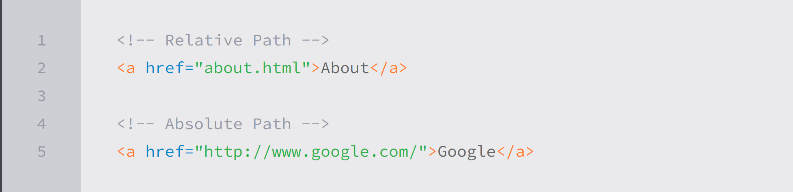
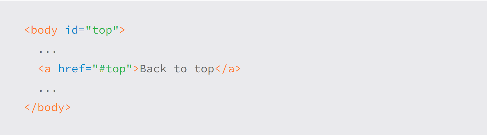

# Building Structure



## Header

The <header\> element, like it sounds, is used to identify the top of a page, article, section, or other segment of a page. In general, the <header\> element may include a heading, introductory text, and even navigation.

```
<header>...</header>
```

## Differences



## Navigation

Used to link to other pages or just use it for major navigation. Like table of contents, next page/previous page.
One off links should be wrapped in anchor element. <a\>

```
<nav>...</nav>
```

## Article

The <article\> element is used to identify a section of independent, self-contained content that may be independently distributed or reused.

If the content of article is placed somewhere else for reuse like email, it should still make sense without the context of previous page. Than you cane use article.

```
<article>...</article>
```

## Section

The <section\> element is used to identify a thematic grouping of content, which generally, but not always, includes a heading.

The <section\> element is commonly used to break up and provide hierarchy to a page.

```
<section>...</section>
```

## Important

---

Decide between article, section and div elements

Use <article\> when the contents can be **reused** independently.

Use <section\> when content adds to the document outline and represents a **thematic** group of content.

Use <div\> when the contents grouped are for **styling purposes**. Dive do not provide value to outline of document.

---

## Aside

The <aside\> element holds content, such as sidebars, inserts, or brief explanations, that is tangentially related to the content surrounding it.

```
<aside>...</aside>
```

## Footer

The <footer\> element identifies the closing or end of a page, article, section, or other segment of a page.

```
<footer>...</footer>
```

## Encoding Special characters

Each encoded character will begin with an ampersand, &, and end with a semicolon, ;. What falls between the ampersand and semicolon is a character’s unique encoding, be it a name or numeric encoding.

```
“resumé” as resum&eacute;
```

## Hyperlinks

Use anchor <a\> and href element. In href you give the destination of page to go to.

```
<a href="http://shayhowe.com">Shay</a>

// it will display Shay on the browser in blue. Clickable link.
```

## Relative & Absolute Paths

Two types of links

1. Links to other pages on same website

- Relative Path
- Do NOT need a domain (.com, .org, .edu, etc.) in the href attribute
- href includes only filename e.g. about.html
- file in different directory -> give complete path in href

2. Links to other website

- Absolute path
- href attribute value must include the full domain.
- href = http://google.com, starting with http and including the domain, .com



### Link to email address

href = mailto:wholeemailaddress@gmail.com

subject and body can also be added in template.

```
<a href="mailto:shay@awesome.com?subject=Reaching%20Out&body=How%20are%20you">Email Me</a>

// ? after email is to bind subject parameter to email
// subject= parameter after the email address.
// encoded spaces %20
//  &, to separate the two body and subject parameter
```

### Opening Links in a New Window

use the **"target"** attribute with a value of **"\_blank"**. The target attribute determines exactly where the link will be displayed, and the \_blank value specifies a new window.

```
<a href="http://shayhowe.com/" target="_blank">Shay Howe</a>
```

### Linking to Parts of the Same Page

Jumping from one point of page to another. One example of it is "Back to top" button.

To create an on-page link, we set up and id attribute on the element we wish to jump/link to. Than, reference the value of id attribute in the href with a # sign within an <a\> element.


