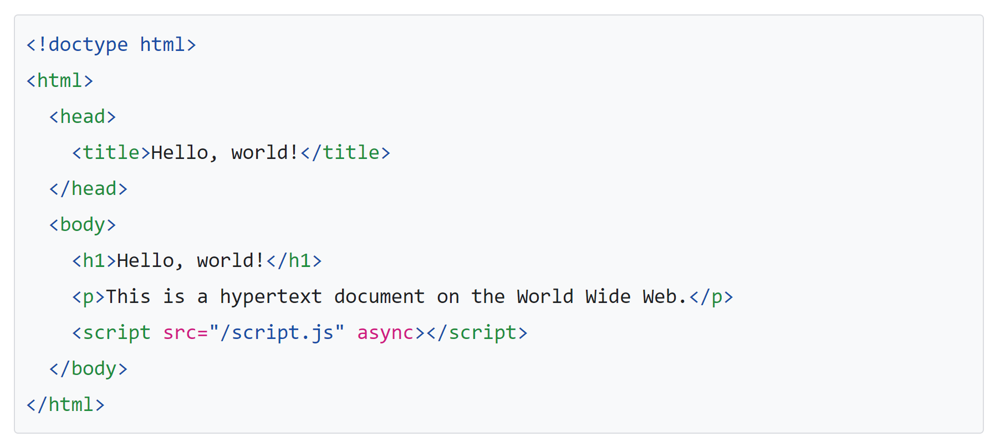
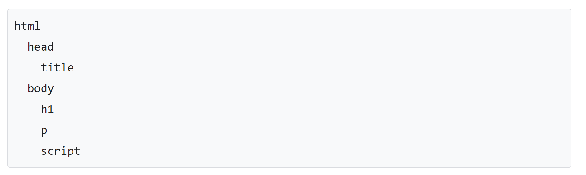
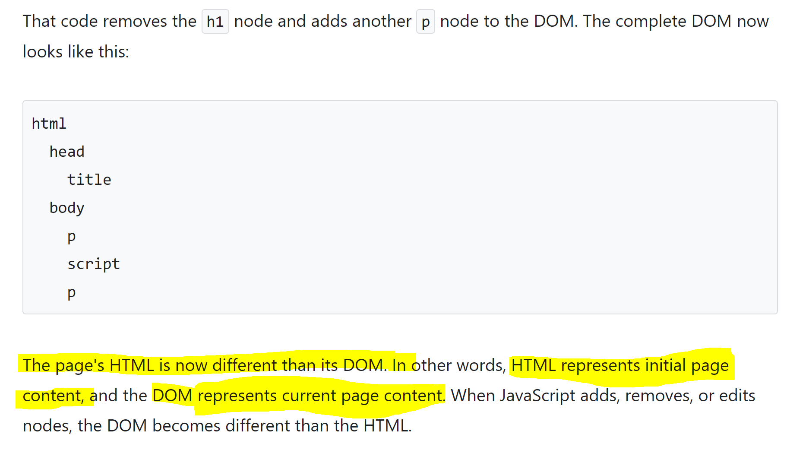

When you use a web browser to request a page like https://example.com the server returns HTML like this:

The browser parses the HTML and creates a tree of objects like this:

This tree of objects, or nodes, representing the page's content is called the DOM.

Suppose that the script referenced at the bottom of the HTML(JS script) do some changes and deletes h1 from DOM and adds another paragraph after the script node.

New DOM will now look like this:

