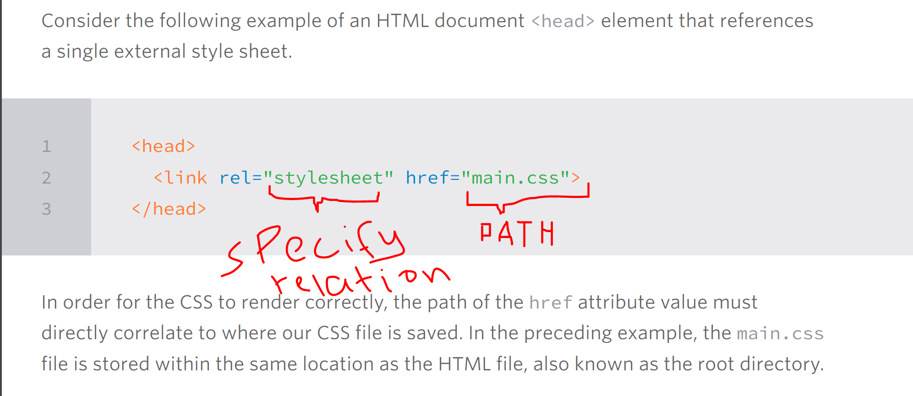

## Referencing Css

Our CSS file should be saved within the same folder, or a subfolder, where our HTML file is located.

Within the \<head\> element of the HTML document, the \<link\> element is used to define the relationship between the HTML file and the CSS file.

## Using CSS Resets

CSS resets take every common HTML element with a predefined style and provide one unified style for all browsers. These resets generally involve removing any sizing, margins, paddings, or additional styles and toning these values down.
