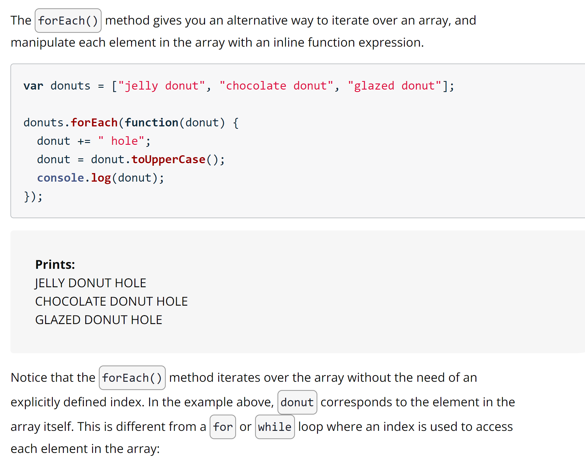
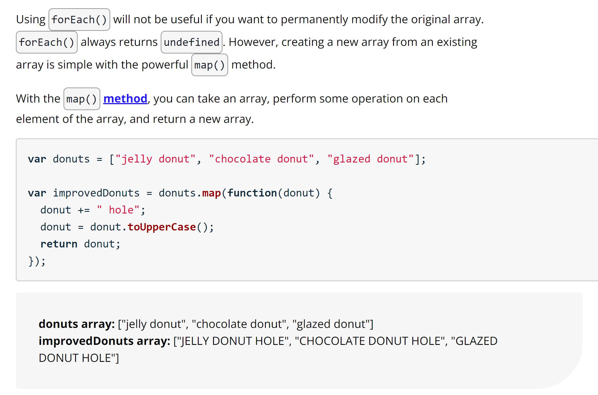

## Arrays

An array is useful because it stores multiple values into a single, organized data structure. You can define a new array by listing values separated with commas between square brackets [].

```
// creates a `mixedData` array with mixed data types

var mixedData = ["abcd", 1, true, undefined, null, "all the things"];
```

### Array.length

Length is a **property** of arrays.

```
var donuts = ["glazed", "powdered", "sprinkled"];
console.log(donuts.length);
//prints 3
```

### Methods of Arrays

- Push

You can use the push() method to add elements to the end of an array.

```
donuts.push("powdered");  // donuts is the array here
// pushes "powdered" onto the end of the `donuts` array
```

## **Important**

---

Notice, with the push() method you need to pass the value of the element you want to add to the end of the array. Also, the **push() method returns the length of the array after an element has been added**.

**Push does not modify original array**.

---

- Pop

Alternatively, you can use the pop() method to remove elements from the end of an array.

```
var donuts = ["glazed", "chocolate frosted", "Boston creme", "glazed cruller", "cinnamon sugar", "sprinkled", "powdered"];

donuts.pop();
// the `pop()` method returns "powdered" because "powdered" was the last element on the end of `donuts` array
```

## **Important**

---

With the pop() method you don’t need to pass a value; instead, pop() will always remove the last element from the end of the array. Also, **pop() returns the element that has been removed in case you need to use it**.

---

- Splice

Splice() is another handy method that allows you to add and remove elements from anywhere within an array.


- forEach()



Parameters:

The function that you pass to the forEach() method can take up to **three parameters**. These are called element, index, and array, but you can call them whatever you like.

Example of forEach()

```
* QUIZ REQUIREMENTS
* Use the existing `test` variable and write a `forEach` loop
* that adds 100 to each number that is divisible by 3.

var test = [12, 929, 11, 3, 199, 1000, 7, 1, 24, 37, 4,
    19, 300, 3775, 299, 36, 209, 148, 169, 299,
    6, 109, 20, 58, 139, 59, 3, 1, 139
];

// Write your code here
test.forEach(function addHundred(value, index){
    if(value % 3 === 0){
        value += 100;
        test[index] = value;
    }
}
    )

console.log(test);
```

- map()


