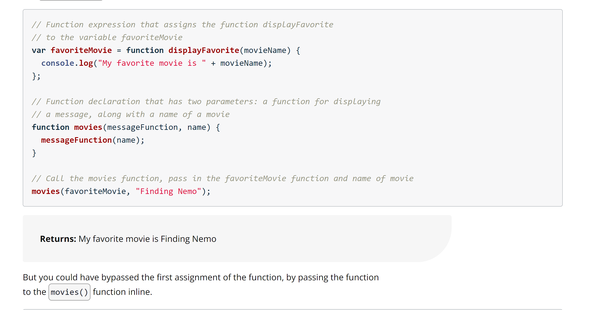
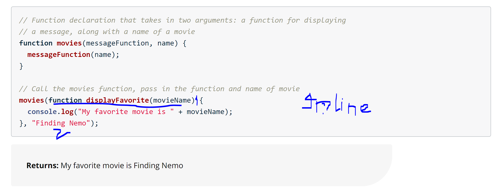

## Functions

---

**Functions** package up code so you can easily use (and reuse) a block of code.

**Parameters** are variables that are used to store the data that's passed into a function for the function to use.

**Arguments** are the actual data that's passed into a function when it is invoked

## Scope

1. If an identifier is declared in global scope, it's available everywhere.

2. If an identifier is declared in function scope, it's available in the function it was declared in (even in functions declared inside the function).

3. When trying to access an identifier, the JavaScript Engine will first look in the current function. If it doesn't find anything, it will continue to the next outer function to see if it can find the identifier there. It will keep doing this until it reaches the global scope.

4. Global identifiers are a bad idea. They can lead to bad variable names, conflicting variable names, and messy code.

## Scope Shadowing

If a variable declared in global scope & then reassigned in function scope, it will save new value from function scope and will always print the new value.

```
var myGlobal = "Janne eyre";
console.log(myGlobal); // Janne eyre

function test(){
  myGlobal = "new Jane eyre";
}

console.log(myGlobal); // "new Jane eyre" shadowed the variable
```

## Hoisting

1. JavaScript hoists function declarations and variable declarations to the top of the current scope.

2. Variable assignments are not hoisted.

3. Declare functions and variables at the top of your scripts, so the syntax and behavior are consistent with each other.

## Function expression

When a function is stored inside a variable it's called a **function expression**.

Notice how the function keyword no longer has a name.

```
var catSays = function(max) {
  // code here
};
```

It's an anonymous function, a function with no name, and you've stored it in a variable called catSays.

# Important\*

## Function expressions and hoisting

All function declarations are hoisted and loaded before the script is actually run. Function expressions are not hoisted, since they involve variable assignment, and only variable declarations are hoisted. The function expression will not be loaded until the interpreter reaches it in the script.

## Function as parameters

A function that is passed into another function is called a **callback**.

```
// function declaration helloCat accepting a callback
function helloCat(callbackFunc) {
  return "Hello " + callbackFunc(3);
}

// pass in catSays as a callback function
helloCat(catSays);
```

## Inline function expressions




