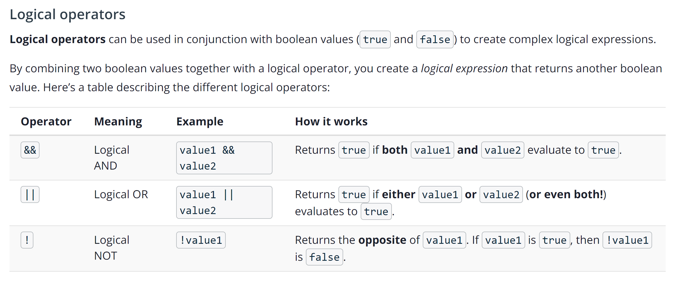
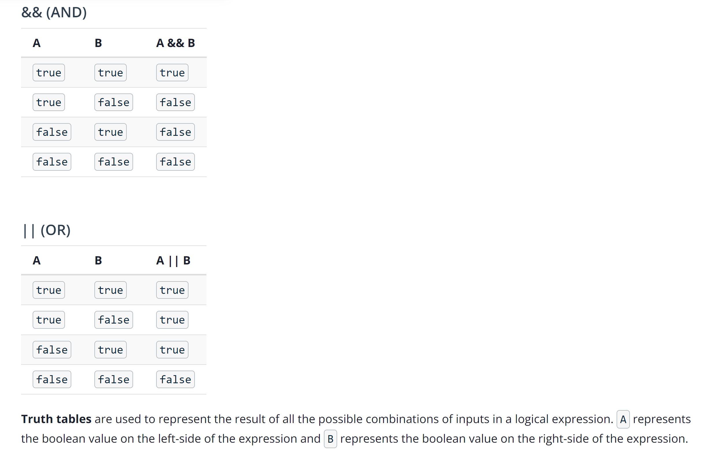
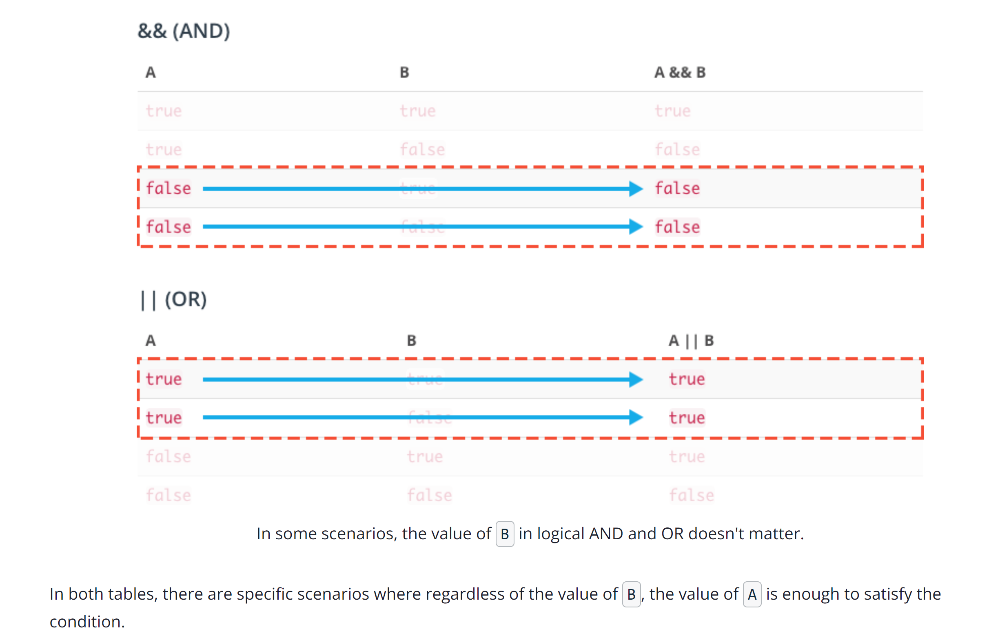

## Logical Operators

### Truth Tables

### Short-circuiting

This behavior is called **short-circuiting** because it describes the event when later arguments in a logical expression are not considered because the first argument already satisfies the condition.
