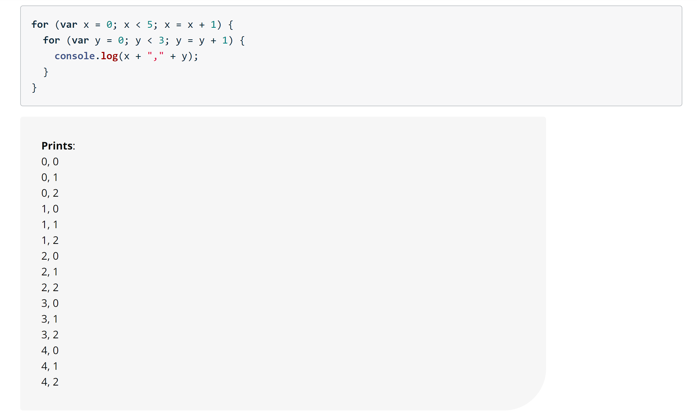

## For Loops

---

```
for ( start; stop; step ) {
  // do this thing
}
```

Here's an example of a for loop that prints out the values from 0 to 5. Notice the semicolons separating the different statements of the for loop: var i = 0; i < 6; i = i + 1

```
for (var i = 0; i < 6; i = i + 1) {
  console.log("Printing out i = " + i);
}
```

### Nested Loops




## While Loops

---

Three main pieces of information that any loop should have are:

1. When to start (x = 0)
2. When to stop (x < 10)
3. How to get to the next item: (x = x+1)


