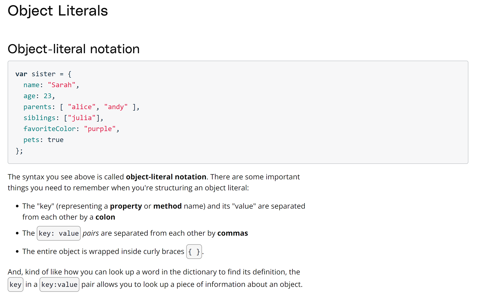
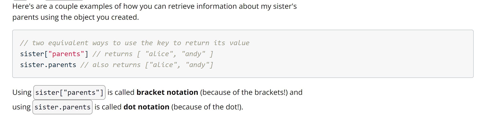
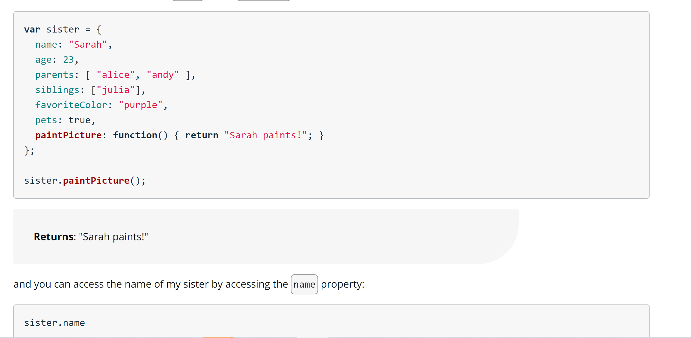

## Objects

---



## Return values from objects



## Methods in Objects



**Important**

---

1. No spaces in property names in objects (car truck : "Melissa" is wrong)
2. No hyphens in property names in objects.
3. Do not start property name(i.e key in key:value) with numbers.
4. Do not put property name in " ".

---

## Object Keys

To return all the keys from an object.

```
const keys = Object.keys(car);

//car is the object defined
```

The above code will print an array of strings, where each string is a key in the car object. ['make', 'model', 'year']
