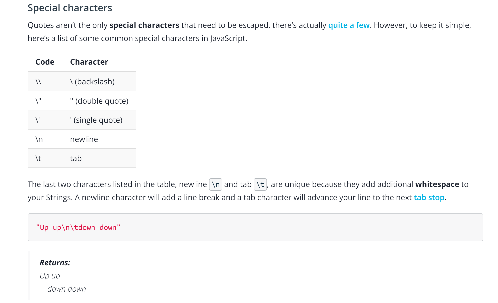

# Strings

## Escape Stringss



## Comparing strings

A. Case Sensitive

```
When you compare strings, case matters.
'Y' != 'y'
```

B. Internal Working

Each character has a specific numeric value, coming from ASCII value of Printable characters. For example, the character 'A' has a value 65, and 'a' has a value 97.

- lowercase letter has a higher ASCII value than the uppercase character
- ASCII values of **[A-Z] ----> [65-90]**
- ASCII values of **[a-z] ----> [97-122]**

```
// Pick a string. Your string can have any number of characters.
var my_string = "a";

// Calculate the ASCII value of the first character, i.e. the character at the position 0.
var ASCII_value = my_string.charCodeAt(0);

// Let us print
console.log(ASCII_value);
```

**Therefore, when we compare strings, the comparison happens character-by-character for the ASCII values.**
