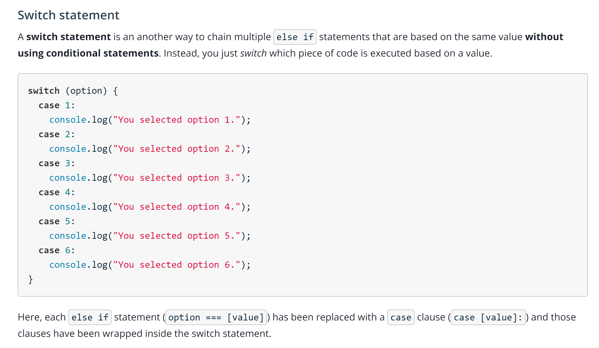

## Switch Statement

---



## Break statement

The break statement can be used to terminate a switch statement and transfer control to the code following the terminated statement. By adding a break to each case clause, you fix the issue of the switch statement falling-through to other case clauses.

```
var option = 3;

switch (option) {
  case 1:
    console.log("You selected option 1.");
    break;
  case 2:
    console.log("You selected option 2.");
    break;
  case 3:
    console.log("You selected option 3.");
    break;
  case 4:
    console.log("You selected option 4.");
    break;
  case 5:
    console.log("You selected option 5.");
    break;
  case 6:
    console.log("You selected option 6.");
    break; // technically, not needed
}
```
