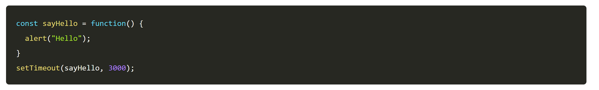
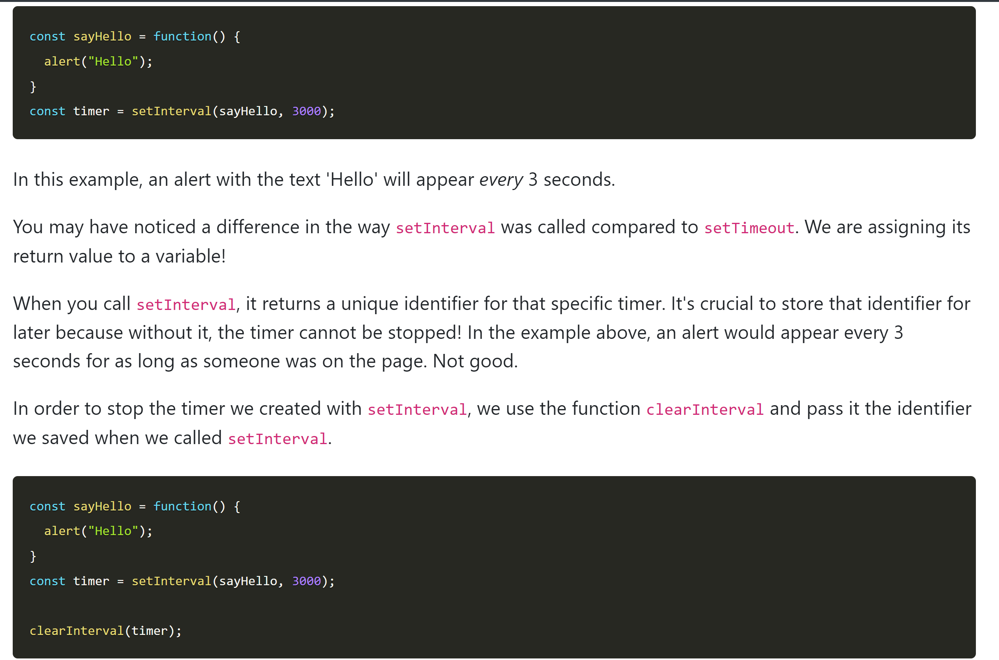

## setTimeout

setTimeout is a function built into JavaScript that runs code after a specified time limit (in milliseconds).

When function is called, it waits till the 3000 milliseconds in 2nd parameter and than executes the "sayHello" function passed as first parameter.

Note: function called in 1st param has no parenthesis.
Function is executed once after 3s and stops.

## setInterval

it calls the function every time the specified amount of milliseconds pass.

