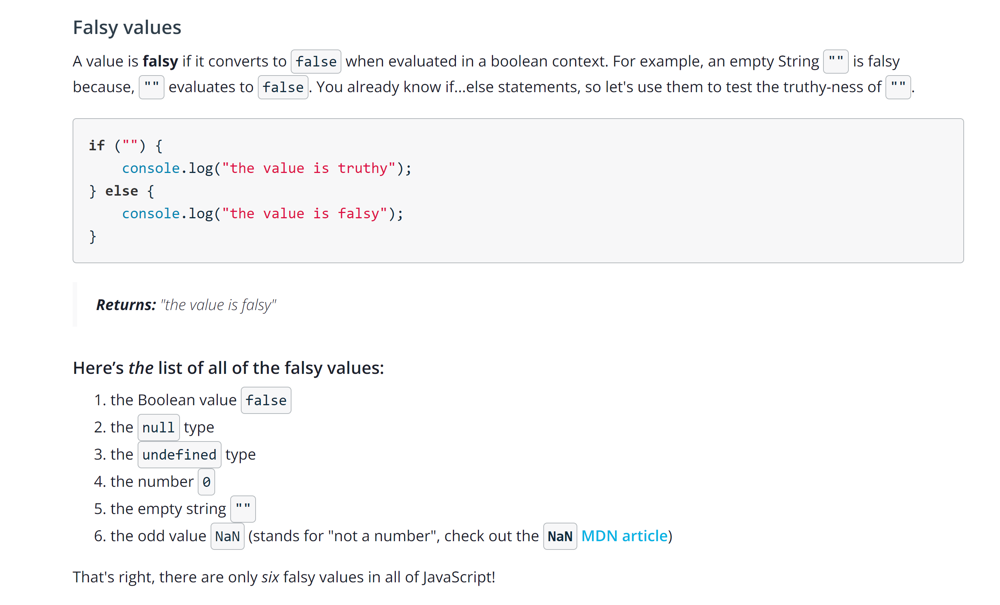

## Truthy and Falsy

Every value in JavaScript has an inherent boolean value. When that value is evaluated in the context of a boolean expression, the value will be transformed into that inherent boolean value.

### Falsy Values

### Truthy Values

